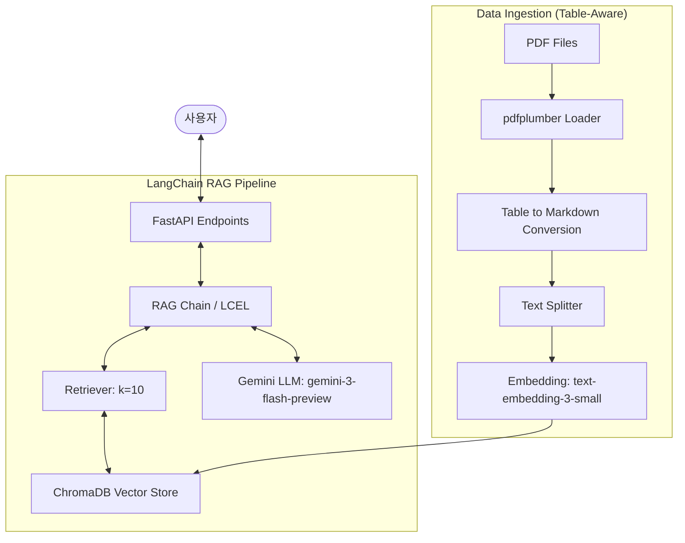

# RAG 시스템 아키텍처 설계 (Week-4)

## 1. 개요 (Overview)
본 프로젝트는 **FastAPI**와 **LangChain**을 활용하여 `2024-2026 알기 쉬운 의료급여제도` PDF 데이터를 기반으로 한 고도화된 **RAG(Retrieval-Augmented Generation)** 서비스를 제공합니다. 시스템은 확장성과 유지보수성을 위해 **도메인 주도 설계(Domain-Driven Design, DDD)** 구조를 채택하였습니다.

## 2. 주요 기술 스택 (Tech Stack)
- **Language**: Python 3.11+
- **Framework**: FastAPI (Asynchronous support)
- **RAG Orchestration**: LangChain (LCEL)
- **LLM Model**: `gemini-3-flash-preview` (via Google Gemini API)
- **Embedding Model**: `text-embedding-3-small`
- **Vector Store**: ChromaDB (Persistent storage)
- **Document Processing**: `pdfplumber` (Table-to-Markdown conversion)
- **Config Management**: Pydantic Settings (.env)

## 3. 시스템 아키텍처 (System Architecture)



## 4. 도메인 기반 프로젝트 구조 (Directory Structure)

```text
week-4/DChanHong/
├── main.py                 # FastAPI 애플리케이션 진입점
├── .env                    # 환경 변수 (모델 설정, API 키)
├── requirements.txt        # 의존성 패키지
├── src/
│   ├── core/               # 시스템 공통 설정 및 보안
│   │   └── config.py
│   ├── domains/            # 비즈니스 도메인별 로직 분리
│   │   └── rag/            # RAG 도메인
│   │       ├── router.py   # API 엔드포인트 정의 (View)
│   │       ├── schemas.py  # API 요청/응답 검증 모델 (DTO)
│   │       ├── models.py   # 도메인 내부 데이터 엔터티 (Entity)
│   │       └── service.py  # 비즈니스 로직 및 LangChain 파이프라인 (Controller)
│   └── utils/              # PDF 로더 및 공통 유틸리티
│       └── pdf_parser.py   # pdfplumber 기반 표 파싱 로직
└── storage/                # ChromaDB 데이터 저장소
```

## 5. 핵심 구현 전략
- **도메인 격리**: 각 도메인(RAG 등)은 자체적인 라우터, 스키마, 모델을 가져 결합도를 낮춤.
- **표 인식 고도화**: `pdfplumber`를 활용하여 PDF 내의 복잡한 표를 마크다운 구조로 추출.
- **최적 검색 설정**: `k=10` 설정을 통해 충분한 컨텍스트 확보.
- **LCEL 활용**: LangChain Expression Language를 통해 비즈니스 로직 유연성 확보.

## 6. 환경 변수 설정 (.env)
```env
GEMINI_API_KEY=your_gemini_api_key
EMBEDDING_MODEL=text-embedding-3-small
LLM_MODEL=gemini-3-flash-preview
```
