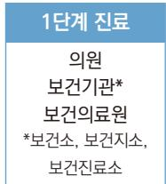
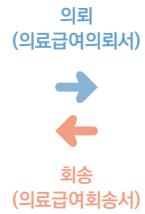
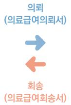

# 2024 알기 쉬운의료급여제도

2024. 2.

## 의료급여제도

1. 의료급여제도 개요 5  
2. 의료급여 절차 6  
3. 의료급여 본인일부부담금 9  
4. 2023년 변경된 의료급여제도 13  
5. 의료급여기준 이력관리시스템 15

## 자주하는 질문

1. 의료급여기준 17  
2. 의료급여 절차 19  
3. 선택의료급여기관 이용절차 25  
4. 수가 기준 및 청구방법 27  
5. 의료급여 정신질환 29  
6. 본인일부부담금 적용 33  
7. 경증질환 약제비 본인부담 차등제 36

## Ⅰ.의료급여제도

1. 의료급여제도 개요

2. 의료급여 절차

3. 의료급여 본인일부부담금

4. 2023년 변경된 의료급여제도

5. 의료급여기준 이력관리시스템

## 의료급여제도 개요

## 01

## 의료급여제도란?

◎ 생활유지 능력이 없거나 생활이 어려운 저소득 국민의 의료문제(질병, 부상, 출산 등)를국가가 보장하는 공공부조 제도로 건강보험과 함께 국민 의료보장의 중요한 수단이 되는사회보장 제도입니다.

## 02

## 의료급여 수급권자란?

◎ 의료급여법에 의한 의료급여를 받을 수 있는 자격을 가진 사람을 말합니다.

## ◎ 수급권자 구분

<table><tr><td>是</td><td>临</td></tr><tr><td>1否个音处</td><td>一，，，，， (，) ● -，会 一 ((， ，，5.18)</td></tr><tr><td>2否个音型外</td><td></td></tr></table>

\* 타법적용자 중 1·2종 구분은 ’23년 1월 1일 신규 수급권 신청자부터 적용

## 03

## 의료급여기관이란?

◎ 「의료법」 및 「약사법」 등에서 정하는 의료기관 및 약국 등을 말합니다.

## ◎ 의료급여기관 구분

<table><tr><td rowspan=1 colspan=1>是</td><td rowspan=1 colspan=1></td></tr><tr><td rowspan=1 colspan=1>1</td><td rowspan=1 colspan=1>，，，，，</td></tr><tr><td rowspan=1 colspan=1></td><td rowspan=1 colspan=1>，</td></tr><tr><td rowspan=1 colspan=1></td><td rowspan=1 colspan=1></td></tr></table>

## 의료급여 절차

## 01

## 의료급여 절차란?

◎ 의료급여는 본인부담이 없거나 소액만 부담하는 특성으로 인해 제2ㆍ3차의료급여기관으로진료가 집중될 수 있는 소지가 높아, 의료자원의 효율적 활용과 대형병원으로의 환자집중현상을 방지하기 위하여 건강보험의 2단계 요양급여와 달리 3단계 의료급여 절차를규정하고 있습니다.

◎ 의료급여 절차에 의하지 않고(의료급여의뢰서 없이) 의료급여기관을 이용한 경우에는진료비 전액을 본인이 부담해야 합니다.

## 02

## 3단계 의료급여 절차

◎ 수급권자가 의료급여를 받고자 하는 경우 먼저 제1차의료급여기관에 의료급여를 신청하여야 합니다.

◎ 진찰 결과 또는 진료 중에 다른 의료급여기관의 진료가 필요한 경우에는 진료담당의사의진료의견이 기재된 ‘의료급여의뢰서’를 제출하여야 합니다.

※ 의료급여의뢰서는 발급받은 날부터 7일(공휴일 제외) 이내에 제2차 또는 제3차의료급여기관에 제출(7일이내에 진료를 예약하고 진료를 받는 때에 의료급여의뢰서를 제출하는 경우에는 예약접수일을 의료급여의뢰서제출일로 봄)

◎ 의료급여를 의뢰받은 의료급여기관은 수급권자의 상태가 호전되는 때에는 ‘의료급여회송서’를수급권자에게 발급하여 회송할 수 있습니다.

## ◎ 의료급여 절차도

병원종합병원

## ◎ 의뢰 순서

• 제1차의료급여기관 → 제2차의료급여기관

• 제2차의료급여기관 → 제2차의료급여기관 또는 제3차의료급여기관

• 제3차의료급여기관 → 제3차의료급여기관

## ◎ 회송 순서

• 제3차의료급여기관 → 제2차의료급여기관 또는 제1차의료급여기관

• 제2차의료급여기관 → 제1차의료급여기관

## ◎ 의료급여 단계별 진료 예외 사항

<table><tr><td rowspan=1 colspan=1>是</td><td rowspan=2 colspan=1>·是，，</td></tr><tr><td rowspan=1 colspan=1>2</td></tr><tr><td rowspan=1 colspan=1></td><td rowspan=1 colspan=1>0H215</td></tr></table>

## 03 선택의료급여기관 이용절차

## ◎ 선택의료급여기관이란?

- 의료급여 상한일수를 초과한 수급자는 여러 의료급여기관 이용에 따른 약제 병용 투여및 중복투약으로 인하여 건강상 위해 발생 가능성이 높으므로, 차기연도 말까지 본인이선택한 의료급여기관을 우선 이용토록 하는 것을 조건으로 상한일수를 연장해드리는제도입니다.

- 다만, 연장승인신청자 중 다음 해 복용할 약제를 처방받은 것으로 인해 당해연도 급여일수가 초과된 사람에 대하여 시·군·구청장은 의료급여심의위원회의 심의를 거쳐 당해연도 선택의료급여기관 지정 제외자로 처리할 수 있습니다.

## ◎ 선택의료급여기관 의료급여 절차

- 선택의료급여기관 외에 다른 의료급여기관에서 진료가 필요한 경우에는 선택의료급여기관에서 의료급여의뢰서를 발급받아 이용하여야 합니다.

## ◎ 재의뢰가 불가한 경우

- 선택의료급여기관으로부터 진료를 의뢰받은 의료급여기관에서 다음의 경우는 재의뢰불가합니다.

• 의뢰받은 제1차의료급여기관 → 제1차의료급여기관으로 재의뢰 불가

• 의뢰받은 제2차의료급여기관 → 제1차 또는 제2차의료급여기관으로 재의뢰 불가

• 의뢰받은 제3차의료급여기관 → 제1차\~제3차의료급여기관으로 재의뢰 불가

## ◎ 선택의료급여기관 단계별 진료 예외사항

<table><tr><td>是</td><td></td></tr><tr><td></td><td>·</td></tr><tr><td></td><td></td></tr></table>

## 의료급여 본인일부부담금

## 01 의료급여기관 이용 시 본인부담률 및 부담액

<table><tr><td rowspan=1 colspan=2>是</td><td rowspan=1 colspan=1>1(是)</td><td rowspan=1 colspan=1>2÷(，否)</td><td rowspan=1 colspan=1>3元()</td><td rowspan=1 colspan=1>蜗</td><td rowspan=1 colspan=1>CT, MRI,PET\a$</td></tr><tr><td rowspan=2 colspan=1>1俗</td><td rowspan=1 colspan=1>题</td><td rowspan=1 colspan=1></td><td rowspan=1 colspan=1>早豆</td><td rowspan=1 colspan=1></td><td rowspan=1 colspan=1></td><td rowspan=1 colspan=1>早豆</td></tr><tr><td rowspan=1 colspan=1>212</td><td rowspan=1 colspan=1>1,000</td><td rowspan=1 colspan=1>1,500</td><td rowspan=1 colspan=1>2,000</td><td rowspan=1 colspan=1>500</td><td rowspan=1 colspan=1>5%</td></tr><tr><td rowspan=2 colspan=1>2语</td><td rowspan=1 colspan=1></td><td rowspan=1 colspan=1>10%</td><td rowspan=1 colspan=1>10%</td><td rowspan=1 colspan=1>10%</td><td rowspan=1 colspan=1>-</td><td rowspan=1 colspan=1>10%</td></tr><tr><td rowspan=1 colspan=1>212</td><td rowspan=1 colspan=1>1,000号</td><td rowspan=1 colspan=1>15%</td><td rowspan=1 colspan=1>15%</td><td rowspan=1 colspan=1>500</td><td rowspan=1 colspan=1>15%</td></tr></table>

※ 경증질환 약국 약제비 본인부담률 3% 적용  
※ 비급여는 전액본인부담, 선별급여는 항목별로 30\~90% 본인부담  
※ 요양병원 입원환자가 의료급여의뢰서 없이 다른 의료기관 이용 시 진료비 전액 본인부담

※ 연장승인(선택의료급여기관) 미신청자(불승인자) 본인부담률 입원 20%, 외래 및 약국 30%

## 02 입원 식대 본인부담률

<table><tr><td rowspan=1 colspan=1></td><td rowspan=1 colspan=1>号</td></tr><tr><td rowspan=1 colspan=1>1语·2e</td><td rowspan=2 colspan=1>20%</td></tr><tr><td rowspan=1 colspan=1>2否0H21</td></tr><tr><td rowspan=1 colspan=1>否型(督奇)</td><td rowspan=1 colspan=1>5%</td></tr><tr><td rowspan=1 colspan=1>，，</td><td rowspan=1 colspan=1>早豆</td></tr></table>

## 03 2, 3인실 입원료 본인부담률

<table><tr><td rowspan=1 colspan=1>是</td><td rowspan=1 colspan=1>202</td><td rowspan=1 colspan=1>3212</td></tr><tr><td rowspan=1 colspan=1>奇</td><td rowspan=1 colspan=1>50%</td><td rowspan=1 colspan=1>40%</td></tr><tr><td rowspan=1 colspan=1>(*)*豆鷲人竺号 (19.11.1.早印)</td><td rowspan=1 colspan=1>40%</td><td rowspan=1 colspan=1>30%</td></tr></table>

※ 본인부담 보상제·상한제 해당되지 않음, 2종장애인의 경우 장애인의료비 지원 없음

## 04 65세 이상 틀니 및 치과 임플란트 본인부담률

<table><tr><td rowspan=1 colspan=1>是</td><td rowspan=1 colspan=1></td><td rowspan=1 colspan=1></td></tr><tr><td rowspan=1 colspan=1>1否</td><td rowspan=1 colspan=1>5%</td><td rowspan=1 colspan=1>10%</td></tr><tr><td rowspan=1 colspan=1>2e</td><td rowspan=1 colspan=1>15%</td><td rowspan=1 colspan=1>20%</td></tr></table>

※ 본인부담 보상제·상한제 해당되지 않음, 2종장애인의 경우 장애인의료비 지원 없음

## 05 추나요법 본인부담률

<table><tr><td rowspan=2 colspan=1></td><td rowspan=1 colspan=2>号山</td><td rowspan=1 colspan=2>全卒，号个卒山</td></tr><tr><td rowspan=1 colspan=1>1e</td><td rowspan=1 colspan=1>2否</td><td rowspan=1 colspan=1>1e</td><td rowspan=1 colspan=1>2e</td></tr><tr><td rowspan=1 colspan=1>，</td><td rowspan=1 colspan=1>30%</td><td rowspan=1 colspan=1>40%</td><td rowspan=2 colspan=1>30%</td><td rowspan=2 colspan=1>40%</td></tr><tr><td rowspan=1 colspan=1>Aa，</td><td rowspan=1 colspan=1>80%</td><td rowspan=1 colspan=1>80%</td></tr></table>

## 의료급여 2종수급권자 본인부담률

## ◎ 치아 홈메우기

<table><tr><td rowspan=1 colspan=2>是</td><td rowspan=1 colspan=1>号早号</td></tr><tr><td rowspan=3 colspan=1>盟</td><td rowspan=1 colspan=1>16川0～180</td><td rowspan=1 colspan=1>5%</td></tr><tr><td rowspan=1 colspan=1>60~150</td><td rowspan=1 colspan=1>3%</td></tr><tr><td rowspan=1 colspan=1>61</td><td rowspan=1 colspan=1>早显</td></tr><tr><td rowspan=1 colspan=1>22</td><td rowspan=1 colspan=1>18从 0計</td><td rowspan=1 colspan=1>05%</td></tr></table>

## ◎ 분만 및 임신부

<table><tr><td rowspan=1 colspan=2>是</td><td rowspan=1 colspan=1>号早号</td></tr><tr><td rowspan=3 colspan=1>盟题</td><td rowspan=1 colspan=1></td><td rowspan=1 colspan=1>早显</td></tr><tr><td rowspan=1 colspan=1></td><td rowspan=1 colspan=1>早显</td></tr><tr><td rowspan=1 colspan=1></td><td rowspan=1 colspan=1>5%</td></tr><tr><td rowspan=1 colspan=1>22</td><td rowspan=1 colspan=1>()</td><td rowspan=1 colspan=1>05%</td></tr></table>

## ◎ 15세 이하 아동

<table><tr><td rowspan=1 colspan=1></td><td rowspan=1 colspan=1>是</td><td rowspan=1 colspan=2>号</td></tr><tr><td rowspan=2 colspan=1>题</td><td rowspan=1 colspan=1>6川吧</td><td rowspan=1 colspan=2>早</td></tr><tr><td rowspan=1 colspan=1>60～150</td><td rowspan=1 colspan=1>3%</td><td rowspan=1 colspan=1></td></tr><tr><td rowspan=4 colspan=1>2</td><td rowspan=2 colspan=1>从吧</td><td rowspan=1 colspan=1></td><td rowspan=1 colspan=1>早显</td></tr><tr><td rowspan=1 colspan=1>23</td><td rowspan=1 colspan=1>5%</td></tr><tr><td rowspan=1 colspan=1></td><td rowspan=1 colspan=1></td><td rowspan=1 colspan=1>早</td></tr><tr><td rowspan=1 colspan=1>5</td><td rowspan=1 colspan=2>05%</td></tr></table>

## ◎ 정신질환 외래진료

<table><tr><td rowspan=1 colspan=1>是</td><td rowspan=1 colspan=1>号早号</td></tr><tr><td rowspan=1 colspan=1>丕</td><td rowspan=1 colspan=1>05%</td></tr><tr><td rowspan=1 colspan=1></td><td rowspan=1 colspan=1>10%</td></tr><tr><td rowspan=1 colspan=1>今**1·2，</td><td rowspan=1 colspan=1>5%</td></tr></table>

## ◎ 치매질환 입원 및 병원급 이상 외래진료 : 5%

## ◎ CT, MRI, PET 등

<table><tr><td rowspan=1 colspan=2>是</td><td rowspan=1 colspan=2>号号</td></tr><tr><td rowspan=1 colspan=1>日(人)</td><td rowspan=1 colspan=1>1</td><td rowspan=1 colspan=2></td></tr><tr><td rowspan=1 colspan=1>5</td><td rowspan=1 colspan=1>1</td><td rowspan=3 colspan=2>5%</td></tr><tr><td rowspan=1 colspan=1>刘叫</td><td rowspan=1 colspan=1>1</td></tr><tr><td rowspan=1 colspan=1></td><td rowspan=1 colspan=1></td></tr><tr><td rowspan=1 colspan=1></td><td rowspan=1 colspan=1>23</td><td rowspan=1 colspan=2>15%</td></tr></table>

## 본인부담금 면제자

<table><tr><td>是</td><td></td></tr><tr><td>1答</td><td>●18 2 ·早 ()(2013.9.30.0)</td></tr><tr><td>2e</td><td>( ， </td></tr></table>

※ 관련근거 : 「의료급여법 시행령」제13조, 「시행령」 별표1, 동법 「시행규칙」 제19조의4

## 2023년 변경된 의료급여제도

## 01 의료급여 식대 수가 인상 및 조산원 의료급여비용명세서 개정(2023.1.3.시행)

◎ 의료급여 일반식·치료식·산모식은 건강보험 의원급 동일수가, 멸균식·분유·경관유동식은건강보험 동일수가로 인상

※ 관련근거 : 「의료급여수가의 기준 및 일반기준」 제12조(식대)

◎ 코로나19 환자의 조산원 분만 수가 적용 위해 의료급여비용 청구방법 및 심사청구서·명세서 서식 작성요령 개정

※ 관련근거 : 「의료급여수가의 기준 및 일반기준」 [별표1], [별지 제8호 서식]

## 02 「노숙인진료시설 지정 등에 관한 고시 」 연장( 2023.3.22.시행)

◎ 전체 제1차 및 제2차의료급여기관을 노숙인진료시설로 지정 유효기간 1년 연장(유효기간: 2023.3.22.\~2024.3.21.)

※ 관련근거 : 「노숙인진료시설 지정 등에 관한 고시」 고시 제2023-48호

## 잠복결핵 치료 관련 진료 본인부담률

◎ 잠복결핵 치료 관련 입원 및 외래진료 : 본인부담 면제

## 인체면역결핍바이러스질환자 관련 진료 본인부담률

◎ 인체면역결핍바이러스질환자의 해당상병 입원 및 외래진료 : 본인부담 면제

## 의료급여 부당청구 사후관리 강화(2023.9.29.시행)

◎ 의료급여 부당청구 의료기관의 위반사실 명단공표 근거 마련※ 관련근거 :「의료급여법」 제29조의3

◎ 의료급여 신고포상금 제도 관련 부정수급 신고 대상 범위 확대 및 신고 유형별 포상금 규정※ 관련근거 : 「의료급여법」 제32조의3, 「의료급여법 시행령」 제18조의2

◎ 부당이득금 징수 대상 및 연대징수 대상 범위 확대※ 관련근거 : 「의료급여법」 제23조

## 의료급여 압류방지 전용통장 관련 근거 마련(2023.9.29.시행)

◎ 의료급여수급권자의 현금급여가 압류방지 전용통장으로 입금될 경우 압류 할 수 없도록하는 법적 근거 마련

※ 관련근거 : 「의료급여법」 제12조의2, 동법 제18조, 「의료급여법 시행령」 제13조의3

## 의료급여증 발급 절차 변경(2023.9.29.시행)

◎ 의료급여증 의무 발급에서 수급권자 신청 시 발급하도록 절차 변경

※ 관련근거 : 「의료급여법」 제8조, 「의료급여법 시행규칙」 제12조

## 의료급여비용정액명세서 서식 개정(2023.10.1.시행)

◎ 의료비 지원 시 일괄 청구를 위한 의료급여비용정액명세서의 ‘의료급여 100분의100 본인부담금 총액’란 신설

※ 관련근거 : 「요양급여비용 청구방법, 심사청구서·명세서서식 및 작성요령」 고시 제2023-103호

07

## 제3차 상대가치개편에 따른 의료급여 종별가산율 조정(2024.1.1.시행)

◎ 의료급여 종별가산율 : 상급종합병원 8%, 종합병원 5%, 병원 2%, 의원 미적용※ 관련근거 : 「의료급여수가의 기준 및 일반기준」 제2조(의료급여기관 종별가산율)

08

## 의료급여 임신·출산 진료비 확대(2024.1.1.시행)

◎ 의료급여 다태아 임신·출산 진료비 확대(일괄 140만원→태아당 100만원)※관련근거 : 「임신·출산 진료비 등의 의료급여기준 및 방법」 제2조

## 의료급여기준 이력관리시스템

## 01 목적

◎ 의료급여는 건강보험과 달리 의료급여 적용기준 및 방법·절차·범위·상한 등이 다양하게운영되고 있습니다. 이에 “의료급여기준 이력관리시스템” 을 구축하여 체계적 관리와 업무효율성 제고는 물론 대내외 정보이용자에 대한 만족도를 제고하고자 합니다.

## 주요 기능 및 내용

◎ 의료급여 기준 제·개정 연혁 및 내용

- 제·개정 사유, 삭제 및 변경 등에 대한 경과 및 세부 사항(법령, 의료급여기준, 고시 등)

◎ 연혁 업로드 내역 : 법령 및 기준

- 의료급여법(시행령, 시행규칙 포함 최근 개정 법령 업로드)

- 의료급여수가의 기준 및 일반기준

- 의료급여 관련 급여기준

## 의료급여기준 이력관리시스템 접속 경로

- 심사평가원 홈페이지 하단 바로가기 메뉴를 통해 접속 가능

요양기관 업무포털 서비스(http://biz.hira.or.kr) → 심사기준 종합서비스 →급여기준 이력조회(http://rulesvc.hira.or.kr) → “의료급여” 이력조회화면

## Ⅱ.자주하는 질문

1. 의료급여기준

2. 의료급여 절차

3. 선택의료급여기관 이용절차

4. 수가 기준 및 청구방법

5. 의료급여 정신질환

6. 본인일부부담금 적용

7. 경증질환 약제비 본인부담 차등제

## 의료급여기준

## Q1. 의료급여환자의 경우 어떠한 경우에 제1차의료급여기관(의원급)에 입원할 수 있나요?

A1.

제1차의료급여기관(의원급)에서는 아래와 같은 경우에 한하여 입원진료를 할 수 있도록규정하고 있습니다.

- 아 래 -

1) 분만 및 수술을 동반하는 경우

2) 정신질환, 한센병환자의 치료, 골절로 인하여 입원치료가 불가피한 경우

3) 입원진료 중 의료급여수급권자로 자격이 변동된 경우

4) 말기암 환자에 대한 입원 진료가 필요한 경우

※ 관련근거 : 「의료급여수가의 기준 및 일반기준」제5조(입원진료 범위)

Q2. 건강보험 산정특례 등록자인데, 의료급여로 자격이 변경되었습니다. 이와 같은 경우,산정특례 혜택을 받으려면 등록을 다시 해야 하는지요?

A2.

상병명(상병코드)이 일치하는 경우에는 다시 등록하지 않으셔도 됩니다. 이와 같은 경우적용기간은 건강보험 산정특례 등록일로부터 5년간 연계 적용됩니다.

Q3. 희귀질환자인데, 희귀질환 외 다른 상병이 있는 경우에도 의료급여의뢰서 없이 제2차또는 제3차의료급여기관에서 진료를 받을 수 있나요?

A3.

보건복지부장관이 정하여 고시하는 등록 결핵질환, 희귀난치성질환 및 중증질환을 가진사람이 의료급여를 받으려는 경우 모든 질환에 대하여 의료급여의뢰서 없이 제2차 또는제3차의료급여기관에서 진료가 가능합니다.

※ 관련근거 :「의료급여법 시행규칙」제3조제1항제3호

## Q4. 의료급여수급권자인데 야간에 응급실에 가게 되었습니다. 응급실에서 진료한 경우의료급여가 적용되는지요?

A4.

야간에 응급실에서 진료한 경우 모두 의료급여가 적용되는 것은 아니며 응급증상 및 이에준하는 증상(「응급의료에 관한 법률 시행규칙」[별표1])으로 진료한 경우 의료급여가 적용되어 응급의료관리료와 본인부담금이 지원됩니다. 참고로 응급증상 및 이에 준하는 증상이아닌데 응급실에 내원하여 진료한 경우에는 의료급여가 적용되지 않으므로 진료비 전액을수급권자가 부담하여야 합니다.

※ 관련근거 : 「응급의료수가기준」 및 「의료급여법 시행규칙」별표1의2

## Q5. 의료급여수급권자가 의료급여의뢰서를 팩스로 발급해 달라고 요청하는데 발급해도 되나요?

A5.

의료급여의뢰서는 진찰결과 또는 진료 중에 제2차 또는 제3차의료급여기관의 진료가필요하다고 판단되는 경우 진료를 담당한 의사가 진료의견을 기재하여 발급토록 하고있습니다. 따라서 환자가 진료를 받지 않고 의료급여의뢰서를 팩스로 요청할 경우, 진료 후발급이 가능함을 안내하여야 합니다.

## 의료급여절차

## Q6. 의료급여수급권자가 퇴원 후 예약진료를 받기 위해 병원을 방문한 경우 의료급여의뢰서를 제출하여야 하나요?

A6.

의료급여수급권자가 동일한 상병의 입원진료 종료 후 해당 상병의 치료와 관련된 외래 진료를받기 위해 진료기관에 재 내원한 경우에는 별도의 의료급여의뢰서를 제출할 필요가 없습니다.※ 관련근거 : 행정해석(보관 65730-368호, ’01.04.02.)

## Q7. 의료급여 절차에 따른 의뢰 시, 의료급여의뢰서는 요양급여의뢰서 또는 의사소견서로대체할 수 있나요?

A7.

의료급여의뢰서는 「의료급여법 시행규칙」별지 제3호 서식으로 발급하여야 하며 요양급여의뢰서 또는 의사소견서 등으로 대체할 수 없습니다.

※ 관련근거 : 「의료급여법 시행규칙」제3조, 「2024 의료급여사업안내」

## Q8. 의료급여의뢰서는 언제까지 제출해야 하나요?

A8.

의료급여의뢰서는 발급받은 날부터 7일(공휴일 제외) 이내에 제출하여야 합니다. 7일 이내에진료를 예약하고 진료 받는 때에 의료급여의뢰서를 제출하는 경우에는 예약접수일을 제출일로 봅니다.※ 관련근거 : 「의료급여법 시행규칙」제3조제4항

Q9. 동일 질환으로 제3차의료급여기관에 재방문할 경우, 의료급여의뢰서를 다시 발급받아가야하나요?

A9.

의료급여의뢰서는 해당 상병의 진료가 종료되는 시점까지 사용이 가능하므로 동일 질환으로제3차의료급여기관에 재방문 시 의료급여의뢰서는 재발급 받지 않아도 됩니다.

Q10. 제1차의료급여기관에서 의료급여의뢰서를 발급받아 제2차의료급여기관에서 진료를받은 후, 다른 상병이 있어 동일 진료과에서 진료를 받아야 하는 경우 의료급여의뢰서를재발급 받아야 하나요?

A10.

의료급여의뢰서의 진료 받은 상병과 관련 없는 타 질환으로 진료 받을 경우에는 동일진료과라 하더라도 의료급여의뢰서를 다시 제출하여야 합니다.

Q11. 의료급여수급권자가 제2차의료급여기관에서 제2차의료급여기관으로 혹은 제3차의료급여기관에서 제2차의료급여기관으로 전원하는 경우, 필요한 서류가 무엇인가요?

A11.

제2차의료급여기관에서 제2차의료급여기관으로 전원하는 경우에는 의료급여의뢰서를,제3차의료급여기관에서 제2차의료급여기관으로 전원하는 경우에는 의료급여회송서를발급받아 제출하여야 합니다.

Q12. 제3차의료급여기관에서 재활운동치료를 받고 있습니다. 제2차의료급여기관으로전원하려면 어떤 절차를 밟아야하나요?

A12.

제3차의료급여기관에서 제2차의료급여기관으로 전원 할 경우 의료급여회송서를 지참하셔야 합니다. 다만 단순 물리치료가 아닌 작업치료, 운동치료 등의 전문재활치료가 필요하여 재활의학과에서 의료급여를 받고자 하는 경우에는 의료급여 단계별 진료의 예외사항에해당되어 의료급여의뢰서나 의료급여회송서가 없어도 제2차의료급여기관에서 의료급여신청이 가능합니다.

※ 관련근거 : 「의료급여법 시행규칙」제3조제1항제9호

Q13. 요양병원에 입원 중인 의료급여수급권자가 다른 의료급여기관의 진료를 위해선의료급여의뢰서가 필요한가요?

A13.

요양병원에 입원 중인 의료급여수급권자가 의료급여의뢰서 없이 다른 의료급여기관 이용 시진료비 전액을 본인이 부담하여야 합니다.

※ 관련근거 : 「의료급여법 시행규칙」별표1의2

Q14. 15세 이하 아동인 의료급여수급권자가 의료급여의뢰서 없이 제2차의료급여기관에방문 하였습니다. 의료급여를 적용받을 수 있나요?

A14.

15세 이하 아동이 의료급여 진료를 받으려는 경우 의료급여 단계별 진료 예외에 해당하여,의료급여의뢰서가 없어도 제2차의료급여기관에서 의료급여를 적용받을 수 있습니다.

※ 관련근거 : 「의료급여법 시행규칙」제3조제1항제14호

## Q15. 등록 장애인이 제2차의료급여기관에서 진료를 받을 경우, 제1차의료급여기관의의료급여의뢰서가 있어야 하나요?

A15.

등록한 장애인의 경우 의료급여 단계별 절차 예외에 해당되어 별도의 의료급여의뢰서 없이 제2차의료급여기관에서 진료를 받으실 수 있습니다. 다만, 등록한 장애인이라 하더라도 선택의료급여기관 대상자인 경우에는 선택의료급여기관의 의료급여의뢰서를 제출하여야 합니다.

※ 관련근거 : 「의료급여법 시행규칙」제3조제1항제11호

Q16. ‌ ‌‌ 건강보험 대상자로 제2차진료기관에서 진료의뢰를 받아 제3차진료기관에서 입원진료를 받고 있던 중 의료급여수급권자로 자격이 변동된 경우, 의료급여의뢰서를재발급 받아야 하나요?

A16.

건강보험에서 요양급여를 받고 있던 중 의료급여대상자로 자격이 변동된 경우 다시 의료급여의뢰서를 발급 받을 필요는 없습니다. 다만, 입원 및 외래진료 중인 상병의 진료가종료된 후 관련 없는 상병으로 진료를 받을 경우에는 의료급여 절차에 따라 제1차 및 제2차의료급여기관에서 발행한 의료급여의뢰서를 발급받아야 합니다.

※ 관련근거 : 행정해석(보관 65730-872호, ’99.07.08.)

Q17. 의료급여수급권자가 제2차의료급여기관에서 국가 암검진을 받은 결과 이상소견이발견되어, 해당병원(검진받은 병원)에서 진료를 받으려하는데 제1차의료급여기관의의료급여의뢰서가 필요한지요?

A17.

제2차의료급여기관(병원)에서 국가암검진을 받은 결과 이상소견이 발견되어 진료담당의사가 검진결과서에 제2차의료급여기관의 진료가 필요하다고 의사소견을 기재한 경우해당 검진결과서를 의료급여의뢰서로 갈음할 수 있습니다. 따라서 제1차의료급여기관의의료급여의뢰서 없이도 검진 받은 제2차의료급여기관에서 진료가 가능합니다.

※ 관련근거 : 행정해석(의급 65730-147호, ’03.04.24.)

## Q18. 제2차의료급여기관에서 국가건강검진을 받았습니다. 검진결과 고혈압 또는 당뇨병질환이 의심되어 확진검사를 받고자 하는데 검진기관인 제2차의료급여기관에서가능할까요?

A18.

일반건강검진 결과 고혈압 또는 당뇨병 질환이 의심되어 확진검사를 받고자 하는 의료급여수급권자는 제1차의료급여기관(의원급)에서 확진검사를 받아야합니다. 다만, 「의료급여법 시행규칙」제3조에 따른 의료급여절차 예외자의 경우에는 제2차 또는 제3차의료급여기관에서 확진 검사를받을 수 있습니다.

※ 관련근거 : 행정해석(기초의료보장과-901호, ’18.01.25.)

## Q19. 응급증상으로 병원에 갈 경우, 반드시 응급실에서 진료를 받아야만 의료급여가 가능한가요?

A19.

「응급의료에 관한 법률」제2조제1호에 해당하는 응급환자인 경우 의료급여의뢰서 없이응급실과 외래 진료 모두 의료급여 혜택을 받을 수 있습니다.

※ 관련근거 : 「의료급여법 시행규칙」제3조제1항제1호

## Q20. 응급환자가 응급진료를 받은 후, 익일에 진료를 받으러 온 경우에는 의료급여의뢰서가필요한가요?

A20.

「응급의료에 관한 법률 시행규칙」제2조 및 동법 시행규칙 별표1에서 정한 응급진료를받은 후 익일에 동일 의료급여기관에서 외래진료를 받는 경우 정당한 진료전달체계를 거친것으로 보고 의료급여가 가능합니다. 그러나 익일 이후에 응급증상이 아닌 것으로 재방문한경우에는 의료급여 단계별 절차 예외사항에 해당하지 아니하므로, 의료급여 절차를 지켜의료급여의뢰서를 발급받아 제출하여야 합니다.

※ 관련근거 : 행정해석(의급 65730-117호, ’03.04.02.)

Q21. 의료급여의뢰서 없이 제2차의료급여기관을 방문하여 진료를 받았습니다. 그리고제3차의료급여기관에서 진료를 받기 위해 제2차의료급여기관의 의뢰서를 발급받은경우, 제3차의료급여기관의 진료비는 의료급여 혜택을 받을 수 있나요?

A21.

「의료급여법 시행규칙」별표1의2에 의하여 수급권자가 제3조의 규정에 의한 의료급여절차에 의하지 아니하고 의료급여기관을 이용한 경우에 소요된 진료비용은 총액의 100분의100 본인부담률을 적용해야 합니다. 위와 같은 경우는 정당한 의료급여 절차에 해당한다고볼 수 없으므로 의료급여 혜택을 받을 수 없습니다.

※ 관련근거 :「의료급여법 시행규칙」제19조

Q22. 야간에 의료급여의뢰서 없이 제2차의료급여기관 응급실에서 진료를 받았는데,응급증상이 아니어서 의료비 전액(100/100)을 부담했습니다. 의료비 전액을 환자가부담하는 게 맞는지요?

A22.

제1차의료급여기관의 의료급여의뢰서 없이 제2차 또는 제3차의료급여기관의 응급실을이용하는 경우 응급증상 또는 이에 준하는 증상에 해당되지 않으면 의료급여 단계별 절차위반으로 의료비 전액(응급의료관리료, 진찰료, 검사비 등)을 환자가 부담하여야 합니다.※ 관련근거 : 「응급의료수가기준」 및 「의료급여법 시행규칙」별표1의2

## 선택의료급여기관 이용절차

Q23. 제1차의료급여기관이 선택기관으로 등록 되어있는 환자가 선택기관을 거쳐 제2차의료급여기관의 진료의뢰를 받아서 제3차의료급여기관에 내원한 경우, 제2차의료급여기관의 의료급여의뢰서만 있으면 의료급여가 적용되나요?

A23.

위와 같이 선택의료급여기관 적용 대상자가 단계별 절차를 거쳐 제3차의료급여기관으로재의뢰되는 경우 제2차의료급여기관의 의료급여의뢰서가 있으면 제3차의료급여기관에서의료급여가 적용됩니다.

※ 관련근거 : 「선택의료급여기관 적용 대상자 및 이용절차 등에 관한 규정」제6조제2항

Q24. 선택의료급여기관 적용대상자가 의료급여의뢰서를 발급받아 제2차의료급여기관에서외래 진료를 받은 후, 다른 제2차의료급여기관에 입원해야 하는 경우 의료급여 의뢰서를재발급 받아야 하나요?

A24.

선택의료급여기관에서 의뢰된 수급권자는 동일 종별(제2차의료급여기관에서 다른 제2차의료급여기관)로 재의뢰는 할 수 없습니다. 따라서 위와 같은 경우에는 선택의료급여기관에서의료급여의뢰서를 재발급 받아 입원 예정인 제2차의료급여기관에 제출하여야 합니다.

※ 관련근거 : 「선택의료급여기관 적용 대상자 및 이용절차 등에 관한 규정」제6조제2항제2호

Q25. 선택의료급여기관 적용 대상자입니다. 어떤 경우에 의료급여의뢰서 없이도 진료를받을 수 있는지 궁금합니다.

A25.

응급증상에 해당하거나 장애인 보조기기를 지급받고자 하는 경우에는 선택의료급여기관의의료급여의뢰서가 없어도 다른 의료급여기관에서 진료 받을 수 있습니다.

※ 관련근거 : 「선택의료급여기관 적용 대상자 및 이용절차 등에 관한 규정」제10조

Q26. 희귀질환 산정특례 대상으로 등록되어 있으면서 제1차의료급여기관이 선택기관으로지정된 의료급여수급자인 경우, 의료급여의뢰서 없이 제2차 또는 제3차의료급여기관에서 의료급여가 적용되나요?

A26.

산정특례등록환자라도 제1차의료급여기관을 선택기관으로 지정되어 있는 경우는 선택기관의의료급여의뢰서를 제출하여야만 제2차 또는 제3차의료급여기관에서 진료가 가능합니다.※ 관련근거 : 「선택의료급여기관 적용대상자 및 이용절차 등에 관한 규정」제10조

Q27. 제1차의료급여기관이 선택의료급여기관으로 지정된 1종수급권자입니다. 선택의료급여기관에서 진료할 수 없는 질환에 대하여 의료급여의뢰서를 발급 받아 다른병의원에서 진료를 받을 경우 본인부담금은 어떻게 되나요?

A27.

선택의료급여기관으로 지정된 제1차의료급여기관에서 진료 받을 경우는 본인부담금이면제되지만, 의뢰 또는 재의뢰되어 진료 받는 기관에서는 본인부담금이 발생됩니다.

(1,000원\~2,000원)

※ 관련근거 : 「의료급여법 시행령」별표1

Q28. 선택의료급여기관에서 의뢰되어 제2차 또는 제3차의료급여기관에서 진료를 받던 중선택의료급여기관이 변경되었습니다. 이 경우 변경된 선택의료급여기관으로부터의뢰서를 다시 발급받아야 하나요?

A28.

선택의료급여기관으로부터 의뢰받아 계속하여 진료 중 다른 선택의료급여기관으로 변경된경우, 동일상병에 대하여 해당진료가 종료될 때까지는 변경된 선택의료급여기관의 의료급여의뢰서 추가 제출 없이 해당 제2·3차의료급여기관의 진료를 받을 수 있습니다. 다만,다른 상병으로 진료를 받을 경우에는 변경된 선택의료급여기관의 진료담당의사의 진료의견이 기재된 의료급여의뢰서를 제출하여야 합니다.

※ 관련근거 : 보건복지부 발간 「2024 의료급여사업안내」

## 수가 기준 및 청구방법

## Q29. ‘의료질평가지원금’, ‘전문병원 관리료’, ‘전문병원 의료질지원금’ 수가를 건강보험과동일하게 의료급여수급권자에게 산정할 수 있나요?

A29.

건강보험 환자와 달리 의료급여수급권자에게는 의료질평가지원금, 전문병원 관리료 등(전문병원 관리료·전문병원 의료질지원금)의 수가를 의료급여비용으로 산정할 수 없습니다.※ 관련근거 : 「의료급여수가의 기준 및 일반기준」제3조제2항

## Q30. 의료급여수급권자에 대한 입원 식대 수가는 건강보험 식대 수가와 동일한가요?

A30.

건강보험의 경우는 요양기관 종별에 따라 식대 항목별 단가가 다르나, 의료급여 식대 수가는종별 구분 없이 항목별(일반식, 치료식 등) 단일 수가 입니다. 또한, 일반식 가산, 치료식영양관리료 등의 가산수가를 적용하지 않습니다.

※ 관련근거 : 「의료급여수가의 기준 및 일반기준」제12조(식대)

## Q31. 의료급여수급자가 만성신부전증으로 외래에서 혈액투석을 받을 경우 수가 산정방법이 어떻게 되나요?

A31.

만성신부전증으로 외래에서 혈액투석을 시행한 경우, 혈액투석 1회당 정액수가(병원급이상: 1,315.22점, 의원: 1,168.07점)에 ‘건강보험요양급여비용의 내역’의 유형별 분류에따른 점수당 단가를 곱한 금액과 혈액투석[1회당](코드 O7020)의 주1(재료대와 약제의비용)과 2(투석액)의 금액을 합하여 산정합니다.

※ 관련근거 : 「의료급여수가의 기준 및 일반기준」제7조(혈액투석수가)

## Q32. 의료급여수급권자가 외래에서 혈액투석을 받은 경우, 혈액투석 정액수가와 별도로수가 청구가 가능한 범주는 어떠한가요?

## A32.

의료급여 혈액투석 정액수가는 진찰료, 혈액투석수기료, 필수경구약제 및 Erythropoietin제제를 포함한 약제, 검사료 등을 포함합니다. 다만, 혈액투석을 위한 정맥내 카테터삽입술또는 혈관중재시술 등의 비용, 감염병의 확산 등에 따른 긴급한 사유로 보건복지부장관이한시적으로 인정하는 항목에 대한 비용 및 만성신부전 관련 합병증이 아닌 다른 상병으로진료를 받는 경우에는 혈액투석 정액수가와 별도로 행위별 명세서를 이용하여 청구가능합니다.

※ 관련근거 : 「의료급여수가의 기준 및 일반기준」제7조(혈액투석수가)

## Q33. 요양병원 입원 중인 산정특례 대상자를 다른 요양기관에 해당 상병으로 진료 의뢰 시,청구방법이 어떻게 되나요?

## A33.

「본인일부부담금 산정특례에 관한 기준」[별표3] “중증질환자 산정특례대상” 중 암환자,중증화상환자와 보건복지부장관이 정하여 고시하는 희귀난치성 질환에 따른 산정특례대상자를 해당 상병으로 진료 의뢰한 경우 진료의뢰를 받은 요양기관에서 청구합니다.(단,의료급여의 경우 조현병, 치매 환자는 의료급여 산정특례 대상자에서 제외됩니다.)

※ 관련근거 : 행정해석(기초의료보장과-7894호, ’20.01.01.)

## 의료급여 정신질환

## Q34. 의료급여 정신건강의학과 입원 및 외래 수가체계는 어떻게 되나요?

## A34.

의료급여수급권자가 정신건강의학과 전문의료급여기관에 입원한 경우에는 기관의인력확보 수준(G1\~G5)에 따른 1일당 정액수가로 산정하며, 외래 진료는 건강보험과동일하게 행위별 수가로 산정합니다.

※ 관련근거 : 「의료급여수가의 기준 및 일반기준」제9\~11조

## Q35. 정신질환으로 입원중인 의료급여수급권자를 다른 의료급여기관으로 외래 진료(내과 등)를 의뢰한 경우, 내과 진료비는 행위별 수가로 청구할 수 있나요?

## A35.

정신질환자가 정신건강의학과 의료진으로 진료가 곤란한 다른 진료과목에 해당하는질환이 발생하였으나 해당 의료급여기관 인력, 시설, 장비로는 치료가 곤란하여 다른의료급여기관으로 외래진료를 의뢰한 경우 진료비는 의뢰받은 의료급여기관에서 행위별외래수가를 적용하여 청구할 수 있습니다. 참고로, 본인일부부담금은 입원 본인부담률을적용합니다.

※ 관련근거 : 「의료급여수가의 기준 및 일반기준」별표1 의료급여비용 청구방법 및 심사청구서 명세서서식작성요령 제4장 3.정액수가 적용건 마.(3)

## Q36. 정신건강의학과에서 퇴원한 환자가 퇴원한 날부터 30일 이내에 재입원하였습니다.이 경우 1일당 입원 정액수가 체감제 적용은 어떻게 되나요?

## A36.

퇴원한 환자가 퇴원한 날부터 30일 이내에 재입원하는 경우에는 입원기간에 종전 입원기간을합산하여 수가를 적용합니다. “퇴원한 날부터 30일 이내”라 함은 퇴원 다음날부터 계산하여30일까지의 기간을 뜻합니다.

※ 관련근거 : 「의료급여수가의 기준 및 일반기준」제11조 제2항 및 행정해석(보관65730-25호, ’01.01.09.)

## Q37. 의료급여수급권자가 정신질환으로 입원치료 받는 경우, 정액수가와 별도로 수가청구가 가능한 범주는 어떠한가요?

A37.

정신질환에 대한 정액수가는 환자 진료에 필요한 진찰료 · 입원료 · 투약료 · 주사료 · 검사료등을 포함합니다. 다만, 입원 기간 중 약품비, 퇴원 투약비용, 마약류 관리료, 입원환자안전관리료, 식대, 정신요법료 및 감염병의 확산 등에 따른 긴급한 사유로 보건복지부장관이한시적으로 인정하는 항목에 대한 비용은 정액수가와 별도로 행위별로 산정할 수 있습니다.※ 관련근거 : 「의료급여수가의 기준 및 일반기준」제9조(정신질환 수가 기준)

## Q38. 정신건강의학과 입원 시 의료급여수급권자가 내야 하는 식대 본인일부부담금은어떻게 되나요?

A38.

의료급여 정신건강의학과 입원 정액수가에서 식대를 분리하여 별도 산정할 수 있도록 함에따라 타 진료과 입원환자와 같이 「의료급여수가의 기준 및 일반기준」제23조제1항에 따라식대 본인일부부담금\*을 내야합니다.

\* 식대의 20%, 산정특례대상 중 중증질환자(합병증 포함) 5%, 행려환자, 자연분만 및 6세미만 아동 면제※ 관련근거 : 「의료급여수가의 기준 및 일반기준」제23조제1항

## Q39. 정신질환 정액진료비 입원일수 산정방법이 궁금합니다.

A39.

정신질환자에 대한 입원수가는 입원일수에 따라 1일당으로 산정하되, 입원 초일 또는퇴원일은 입·퇴원시간 불문하고 1일의 입원일수를 산정합니다.

※ 관련근거 : 행정해석(보관65730-25호, ’01.01.09.)

Q40. 보호입원 혹은 행정입원이 필요한 정신질환자의 입원여부 확인을 위하여 방문의사가 의뢰기관으로 방문한 경우, 건강보험과 동일하게 의료급여 환자에게도‘치료입원 확인료 및 치료입원확인관리료’ 수가를 별도로 산정할 수 있나요?

A40.

‘치료입원확인료’와 ‘치료입원확인 관리료’ 수가는 건강보험과 동일 수가코드를 적용하여의료급여정액명세서에 별도 산정이 가능합니다.

※ 관련근거 : 「정신건강복지법 시행에 따른 2인 의사 입원진단을 위한 수가시범사업 지침」, ’17.05.30. 시행

## Q41. 정신건강의학과 전문의료급여기관에서 정신질환에 대한 외래진료 시 원외처방이가능한가요?

A41.

정신질환 외래진료 시 약제 직접조제로 한정하는 고시 문구가 2018년 8월 1일부터 삭제됨에따라, 의료급여수급권자가 정신질환으로 외래진료 시 약사법에 따라 약제는 원외처방을하여야 합니다. 다만, 약사법 제23조제4항제3호에 의거 ‘조현병 또는 조울증 등으로 자신또는 타인을 해칠 우려가 있는 정신질환자’의 경우에는 원내 직접조제가 가능합니다.

※ 관련근거 : 「의료급여수가의 기준 및 일반기준」(고시 제2018-143호, ’18.08.01.시행), 「약사법」제23조

## Q42. 법정 시설 · 장비기준 미준수 정신의료기관의 경우 정신건강의학과 입원료 기관등급은 어떻게 조정되나요?

A42.

법정 시설 · 장비기준 미준수 정신의료기관의 경우 인력 확보수준에 따라 산정된 기관등급을기준으로 G1→G2, G2→G3, G3→G4, G4→G5로 조정되며, G5등급은 G5등급으로적용받게 됩니다.

※ 관련근거 : 「의료급여수가의 기준 및 일반기준」(고시 제2021-210호, ’21.07.30.시행) 의료급여 입원료정액수가 관련 질의 · 답변

## Q43. 계약의사가 사회복지시설에 입소 중인 의료급여수급권자에게 진료를 한 경우산정되는 수가와 본인부담금은 어떻게 되나요?

A43.

의료급여기관에 소속된 계약의사가 시설 내에서 진료 후 사회복지시설 입소자에게원외처방전을 발행하거나 원내 직접조제·투약한 경우 건강보험과 동일한 수가를 산정하며,본인일부부담금은 1, 2종 수급권자를 불문하고 1,000원\~1,500원을 부담합니다. 단, 1종수급권자 중 외래본인부담면제자의 경우 본인부담금을 면제합니다.

※ 관련근거 : 「의료급여수가의 기준 및 일반기준」제17조의5

## Q44. 정신건강의학과 정액입원 명세서 청구 시 정신건강의학과 입원료 차등제에 따른기관등급(G1\~G5)별 정신요법료 횟수 제한이 있나요?

A44.

차등제 기관등급별 정신요법료 실시 최소기준은 없으며, 「건강보험 행위 급여·비급여목록표 및 급여 상대가치점수」정신요법료 산정지침 및 청구방법 등에 따릅니다.

※ 관련근거 : 「요양급여비용 청구방법, 심사청구서·명세서서식 및 작성요령」(고시 제2021-85호,

’21.03.22.시행) 의료급여 명세서 세부작성요령 질의·답변

## 본인일부부담금 적용

## Q45. 건강보험 본인일부부담금 산정특례대상이 의료급여수급권자에게도 동일하게 적용되나요?

A45.

산정특례 대상의 경우, 정신질환과 치매질환을 제외하고 건강보험과 동일하게 적용됩니다.※ 관련근거 : 「의료급여수가의 기준 및 일반기준」[별표2]

## Q46. 의료급여 등록 희귀질환자인 경우, 등록된 희귀질환이 아닌 다른 상병으로 외래진료를 받을 경우에도 본인부담금이 면제되나요?

A46.

보건복지부장관이 정하여 고시하는 결핵질환, 희귀난치성질환 또는 중증질환을 가진사람이 외래진료를 받을 경우 급여비용총액 전부를 기금에서 부담하여, 해당 질환 이외의상병으로 외래진료를 받은 경우에도 본인일부부담금이 면제됩니다.

※ 관련근거 : 「의료급여법 시행령」[별표1] 제1호다목

## Q47. 의료급여 선별급여 본인부담은 건강보험 선별급여 본인부담과 다른가요?

A47.

건강보험과 동일한 본인부담률을 적용받습니다.

※ 관련근거 : 「의료급여수가의 기준 및 일반기준」제23조의2

## Q48. 65세 이상 틀니 진료 시 본인부담률은 어떻게 되나요?

A48.

65세 이상 수급권자가 틀니에 대한 의료급여를 입원 또는 외래에서 받은 경우 본인부담률은 1종수급권자는 5%이며, 2종수급권자는 15%입니다.

※ 관련근거 : 「의료급여법 시행령」[별표1] 제1호라목, 제2호마목

## Q49. 65세 이상 치과 임플란트 진료 시 본인부담률은 어떻게 되나요?

A49.

65세 이상 수급권자가 임플란트에 대한 의료급여를 입원 또는 외래에서 받은 경우 본인부담률은 1종 수급권자는 10%, 2종수급권자는 20%입니다.

※ 관련근거 : 「의료급여법 시행령」[별표1] 제1호마목, 제2호바목

## Q50. 의료급여수급권자의 입원 식대 본인부담률은 얼마인가요?

## A50.

식대 본인부담률은 식대 금액의 20%입니다. 다만, 중증질환자에게 해당 중증질환(합병증포함)으로 진료한 경우에는 식대 금액의 5%이며 행려환자, 자연분만 및 6세미만의 아동의입원진료의 경우에는 식대 본인부담금을 면제합니다.

※ 관련근거 : 「의료급여법 시행규칙」[별표1의2], 「의료급여수가의 기준 및 일반기준」제23조

## Q51. 의료급여 2종수급권자 중 15세 이하 아동이 입원한 경우, 본인부담 적용은 어떻게 되나요?

A51.

6세 미만의 아동은 식대를 포함한 입원 진료비가 면제 적용됩니다. 6세 이상 15세 이하아동인 경우는 입원 본인부담률이 3%이나, 식대 본인부담률은 20%를 적용 받습니다.※ 관련근거 : 「의료급여법 시행령」[별표1] 제2호

## Q52. 의료급여 2종수급권자인 18세 이하 아동이 입원진료 중에 치아홈메우기 진료를시행한 경우, 본인부담 적용은 어떻게 되나요?

## A52.

치아홈메우기 급여비용을 포함한 전체 급여비용에 대하여 6세 미만 아동은 면제가 되고,6세 이상 15세 이하 아동은 본인부담률 3%를 적용받습니다. 16세 이상 18세 이하 아동인경우에는 치아홈메우기 급여비용에 한하여 본인부담률 5%를 적용받습니다.

※ 관련근거 : 「의료급여법 시행령」[별표1] 제2호

## Q53. 본인부담금 보상제 및 상한제는 모든 급여대상 본인부담금 기준으로 보상을 하나요?

## A53.

수급권자의 급여대상 본인부담금이 대통령령에서 정하는 금액을 초과한 경우, 그 초과금액의전액에 해당하는 금액을 보상해드립니다. 그러나 비급여대상, 100/100 본인부담 진료비,65세 이상 치과 틀니 및 임플란트 비용, 상급병실(2ㆍ3인실) 입원료, 추나요법 및 연장승인미신청 등으로 인한 건보부담적용금액 등은 지급에서 제외 됩니다.

## 경증질환 약제비 본인부담 차등제

## Q54. 의료급여 경증질환 약제비 본인부담 차등제도는 건강보험과 동일한가요?

## A54.

제도의 기본원칙, 적용대상 질환은 동일하나, 본인부담률, 적용제외 대상 등에서 차이가있습니다.

<table><tr><td rowspan=1 colspan=1>是</td><td rowspan=1 colspan=1></td><td rowspan=1 colspan=1></td></tr><tr><td rowspan=1 colspan=1></td><td rowspan=1 colspan=1>「[</td><td rowspan=1 colspan=1></td></tr><tr><td rowspan=1 colspan=1></td><td rowspan=1 colspan=1>%%</td><td rowspan=1 colspan=1>3%</td></tr><tr><td rowspan=1 colspan=1>临</td><td rowspan=1 colspan=1></td><td rowspan=1 colspan=1></td></tr></table>

## Q55. 의료급여수급권자의 경우 경증질환으로 상급종합병원과 종합병원 외래진료 시약국 약값 외에 병원 진료비에 대한 본인부담금도 달라지나요?

## A55.

상급종합병원과 종합병원 외래 진료 시 본인부담금은 현행과 같이 1종은 1,500\~2,000원,2종은 총 진료비의 15%입니다.

## Q56. 일반 환자가 복합질병(경증질환 + 그 외 다른 질환)으로 상급종합병원과 종합병원외래에서 진료 후 약국에서 내야하는 약값은 얼마인가요?

A56.

동일의사에게 진료 받은 경우 경증질환이 주된 상병이고 일반질병이 부수적인 상병일경우에 한하여 약제비용의 3%를 환자가 내야합니다. 그러나 서로 다른 진료과에서 각각의질병에 대해 진료를 받은 경우에는 아래 예시와 같이 일반질병은 처방전 1매당 500원,경증질환은 약국 약값 전체 금액의 3%를 합한 금액을 부담하면 됩니다.

※ 약국 의료급여비용총액의 3%가 500원 미만일 경우에는 500원 부담

※ <적용예시> 결막염(경증 질병)과 급성세기관지염(일반 질병)으로 상급종합병원 또는 종합병원외래진료 후 처방전을 발급 받아 약국에서 조제 받는 경우 환자가 내야하는 약값

<table><tr><td rowspan=2 colspan=1>是</td><td rowspan=1 colspan=2></td><td rowspan=1 colspan=2></td></tr><tr><td rowspan=1 colspan=1>()()</td><td rowspan=1 colspan=1>()()</td><td rowspan=1 colspan=1>器</td><td rowspan=1 colspan=1></td></tr><tr><td rowspan=1 colspan=1>早</td><td rowspan=1 colspan=1>500号</td><td rowspan=1 colspan=2>3%500500</td><td rowspan=1 colspan=1>500号</td></tr></table>

## Q57. 경증질환으로 약제비 본인부담률을 3% 적용하였으나, 추후 다른 질병으로 확진된경우 본인부담금에 대한 환급이 가능한가요?

A57.

약제비 차등적용 질병으로 약국 약제비 본인부담을 차등적용 받았으나, 이후 다른 질병으로확진되더라도 이전에 이루어진 약국 약제비 본인부담 차등적용은 소급적용하지 않으므로,본인부담금은 환급 처리되지 않습니다.

## Q58. 인슐린을 처방받는 당뇨병인 경우에도, 경증질환 약제비 차등적용에 해당되나요?

A58.

차등적용 예외규정은 약국 약제비 본인부담 차등적용 질병에 해당되나 당뇨병으로 인슐린을투여 중 이거나 일부 상병에서 6세 미만의 소아인 경우, 의원에서 진료의뢰서를 지참하여종합병원에서 진료받는 경우(진료의뢰서 90일 한도)에는 약국 약제비 본인부담 차등을적용하지 않는 기준을 말합니다.

## 건강보험심사평가원은건강하고 안전한 의료문화를 열어가는국민의료심사평가기관으로 보건의료의 발전을 통한국민건강 증진을 위해 힘쓰겠습니다.

## 부정청탁 금지

## 금지내용

• 누구든지 직무를 수행하는 공직자등에게 직접 또는 제3자를 통한 부정청탁 금지

## 예외사유

• 법령 기준에서 정하는 절차·방법에 따라 특정한 행위를 요구하는 행위

• 공개적으로 특정한 행위를 요구하는 행위

• 선출직 공직자·정당·시민단체 등이 공익적인 목적으로 제3자의 고충민원을전달하는 행위

• 법정기한 안에 처리해 줄 것을 신청·요구하거나 그 진행 상황 · 조치결과 등에대하여 확인 · 문의하는 행위

• 직무 또는 법률관계에 관한 확인·증명 등을 신청·요구하는 행위

• 질의 또는 상담형식을 통하여 직무에 관한 법령·제도·절차 등에 대하여 설명이나해석을 요구하는 행위

• 그 밖에 사회상규에 위배되지 아니하는 것으로 인정하는 행위

## 제재내용

<table><tr><td rowspan=1 colspan=1>H</td><td rowspan=1 colspan=1></td></tr><tr><td rowspan=1 colspan=1></td><td rowspan=1 colspan=1></td></tr><tr><td rowspan=1 colspan=1></td><td rowspan=1 colspan=1>22(</td></tr><tr><td rowspan=1 colspan=1></td><td rowspan=1 colspan=1>2</td></tr></table>

## 2024 알기 쉬운 의료급여제도

2024년 2월발 행

건강보험심사평가원 의료급여실발 행 처

강원특별자치도 원주시 입춘로 130(반곡동)주 소

1644-2000전 화

사)강동장애인협회 정다운 우리들인 쇄

이 책은 저작권법에 따라 보호받는 저작물이므로

건강보험심사평가원의 허락 없이 무단으로 사용할 수 없습니다.